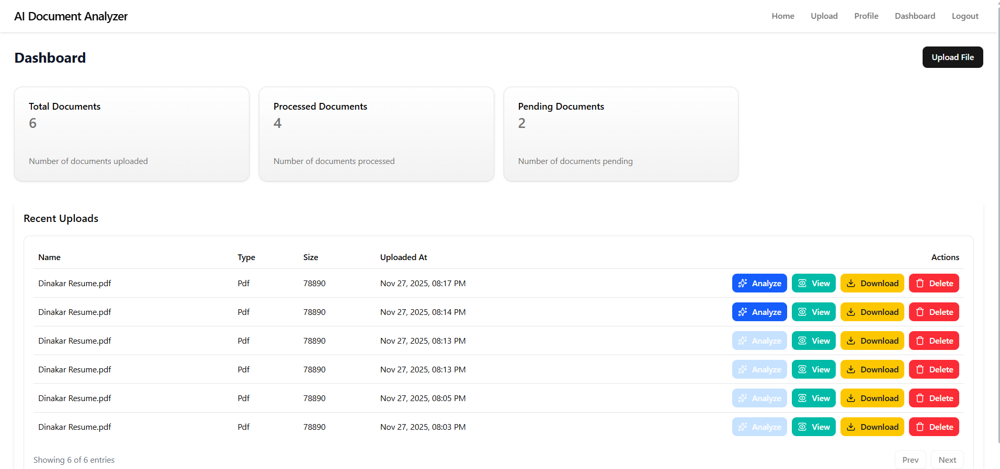
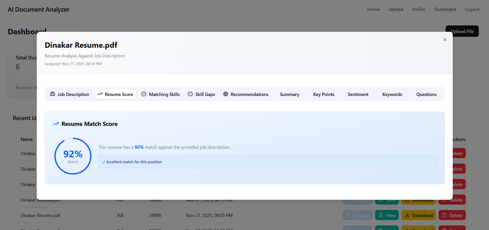

# AI Resume Analyzer (Modern ATS Checker)

AI Resume Analyzer is a modern Applicant Tracking System (ATS) checker and resume analysis platform that leverages large language models to provide resume fit insights against a job description. It extracts resume text, runs an AI-driven analysis (summary, match score, matching skills, gaps, recommendations, keywords, sentiment, suggested questions), and exposes a simple web UI to upload, analyze, preview and download documents.

This repository contains two parts:

- `backend/` — Node.js + Express API, MongoDB models, worker job to call LLM providers
- `frontend/` — React + Vite frontend (Tailwind / shadcn-style components)

---

## Highlights

- Resume analysis against a provided Job Description (JD)
- Stores original file and extracted text in MongoDB
- LLM-driven JSON response is parsed and persisted as structured analysis
- Resume-specific fields: `resumeScore`, `matchingSkills`, `skillGaps`, `recommendations`
- Live polling + socket notifications for analysis status
- Clean UI with tabs for insights and a preview modal

---

## Screenshots

- Dashboard / Upload



- Dashboard Upload


- Upload Page


- Upload dialog (file + job description)


- Detailed resume insights



---

## Quick Start (Windows PowerShell)

Prerequisites:

- Node.js >= 18
- npm or yarn
- MongoDB connection (local or cloud)
- Optional: OpenAI / Anthropic / Google Gemini API keys (or server default key)

1. Clone the repo

```powershell
git clone https://github.com/Dinakar2329/ai-document-analyzer.git
cd ai-resume-analyzer
```

2. Backend setup

```powershell
cd backend
npm install
# create .env (see below for required variables)
# then start the server (development)
npm run dev
# or
node server.js
```

3. Frontend setup

```powershell
cd ../frontend
npm install
npm run dev
# the site will be served by Vite (default http://localhost:5173)
```

4. Open the frontend in the browser and log in / upload files.

---

## Environment Variables

Backend (`backend/.env`):

- `PORT` — port for backend server (default 5000)
- `MONGO_URI` — connection string for MongoDB
- `OPENAI_API_KEY` — server fallback OpenAI API key (optional)
- `JWT_SECRET` — secret for signing JWTs used for auth

Frontend (`frontend/.env` or `vite` env):

- `VITE_BACKEND_URL` — URL of backend API (e.g., `http://localhost:5000`)

Note: The backend supports per-user API keys stored in the user profile (if implemented). If a user has their own API keys, those will be used in preference to the server fallback key.

---

## Backend: Design and Key Endpoints

Project structure (backend):

```
backend/
  server.js            # Express entry
  controllers/
    documentsController.js  # handles upload, listing, preview, analyze
  models/
    Document.js        # stores file info, extracted text, jobDescription, analysis ref
    Analysis.js        # stores parsed AI output (summary, resumeScore, matchingSkills, ...)
  jobs/
    worker.js          # queue processor that calls AI providers and writes Analysis
  utils/
    aiProvider.js      # adapter to OpenAI / Anthropic / Gemini
    file.js
    socket.js
```

Important API endpoints:

- `POST /api/docs/upload` — multipart form upload. Fields:

  - `file` — file to upload (PDF, TXT, DOCx depending on parser)
  - `jobDescription` — optional text field (string)
  - Requires Authorization header `Bearer <token>`

- `GET /api/docs` — list user's documents. Supports pagination `?page=1&limit=10` and `?q=` text search.

  - Returns `docs` containing document metadata and populated `analysis` object (status, summary, resumeScore, matchingSkills, skillGaps, recommendations, processedAt, ...)

- `GET /api/docs/:id/preview` — show detailed info for a single document including text, jobDescription and analysis.

- `POST /api/docs/:id/analyze` — triggers analysis for the document (creates Analysis record and enqueues job).

- `DELETE /api/docs/:id` — deletes doc and associated analysis, removes uploaded file.

- `GET /api/docs/:id/download` — download original file.

---

## Data model notes

- `Document` model fields (not exhaustive):

  - `user` (ObjectId)
  - `filename`, `originalName`, `mimeType`, `size`
  - `text` (extracted plain text from file)
  - `jobDescription` (string, optional)
  - `analysis` (ObjectId -> Analysis)

- `Analysis` model fields added for resume checking:
  - `status` — `pending` | `processing` | `done` | `failed`
  - `summary` — short summary
  - `keyPoints` — array
  - `sentiment` — { label, score }
  - `keywords` — array
  - `questions` — array
  - `resumeScore` — number (0-100)
  - `matchingSkills` — array of strings
  - `skillGaps` — array of strings
  - `recommendations` — array of strings
  - `rawResponse` — raw LLM output (Mixed)

These fields are persisted in the `Analysis` collection when the worker processes a job.

---

## How analysis works (brief)

1. Upload a resume file (and optionally paste the Job Description).
2. Backend extracts text (PDF parser or text read) and creates a `Document` entry with `jobDescription` attached.
3. When the user triggers analysis (or analysis automatically starts), the backend creates an `Analysis` record with `status: processing` and enqueues the document id.
4. Worker picks the job, builds a prompt using the resume text + jobDescription (if provided), sends it to the configured provider via `utils/aiProvider.js`.
5. Worker expects a JSON object from the model, extracts it, falls back to best-effort parsing, and stores structured fields in `Analysis` (summary, resumeScore, matchingSkills, skillGaps, recommendations, etc.).
6. Frontend polls or receives socket events and displays the results in the preview modal.

---

## Frontend: Features and Notes

- Upload dialog accepts multiple files and an optional Job Description (JD). The JD is attached to each uploaded file.
- Dashboard lists recent uploads with analysis status and quick actions: Analyze, View, Download, Delete.
- Preview modal (`View`) shows tabs:
  - Job Description (if provided)
  - Resume Score (visual circular indicator)
  - Matching Skills
  - Skill Gaps
  - Recommendations
  - Summary, Key Points, Sentiment, Keywords, Suggested Questions
- Polling logic on analyze button checks `GET /api/docs/:id/preview` until analysis status is `done` or `failed`.

---

## Example: Upload using curl

```bash
curl -X POST "${VITE_BACKEND_URL:-http://localhost:5000}/api/docs/upload" \
  -H "Authorization: Bearer <token>" \
  -F "file=@/path/to/resume.pdf" \
  -F "jobDescription=Senior Backend Engineer with Node.js and MongoDB experience"
```

---

## Running locally (development tips)

- If you are developing both backend and frontend, run backend at `http://localhost:5000` and set `VITE_BACKEND_URL=http://localhost:5000` in the frontend.
- Use nodemon or `npm run dev` for the backend to auto-restart when you change server code.
- Use `npm run dev` in frontend for hot-reload.

---

## Troubleshooting

- Invalid or missing analysis fields:

  - Check worker logs: `backend/jobs/worker.js` prints errors and the raw LLM response.
  - If the model doesn't return proper JSON, the `extractJson` function tries to parse fenced JSON or the first JSON object in the response. Inspect `rawResponse` in the `Analysis` document.

- Dates look invalid in UI:

  - The frontend converts dates to ISO and formats them for display. If dates are missing, ensure `analysis.processedAt` is saved by the worker.

- LLM provider errors:
  - Confirm API keys are set in `.env` or per-user keys present in the DB.

---

## Extending / Customization

- Add support for additional file types (DOCX) by integrating an appropriate parser in `controllers/documentsController.js` -> `extractText`.
- Add more providers or tweak `aiProvider.js` to change model parameters or prompt templates.
- Add user-level AI key UI to let users submit their own provider credentials.

---

## Developer Notes

- Worker prompt logic is in `backend/jobs/worker.js` — this contains the resume-specific JSON schema the model should return. Keep the prompt explicit to force JSON-only output.
- `aiProvider.js` has adapters for OpenAI / Anthropic / Gemini. Confirm versions and SDK semantics when upgrading.
- Keep `Analysis.rawResponse` to help debug parsing issues.

---

## License

This project is provided as-is for demonstration and development. Add a license file as needed (e.g., MIT) and update `package.json` metadata accordingly.

---
